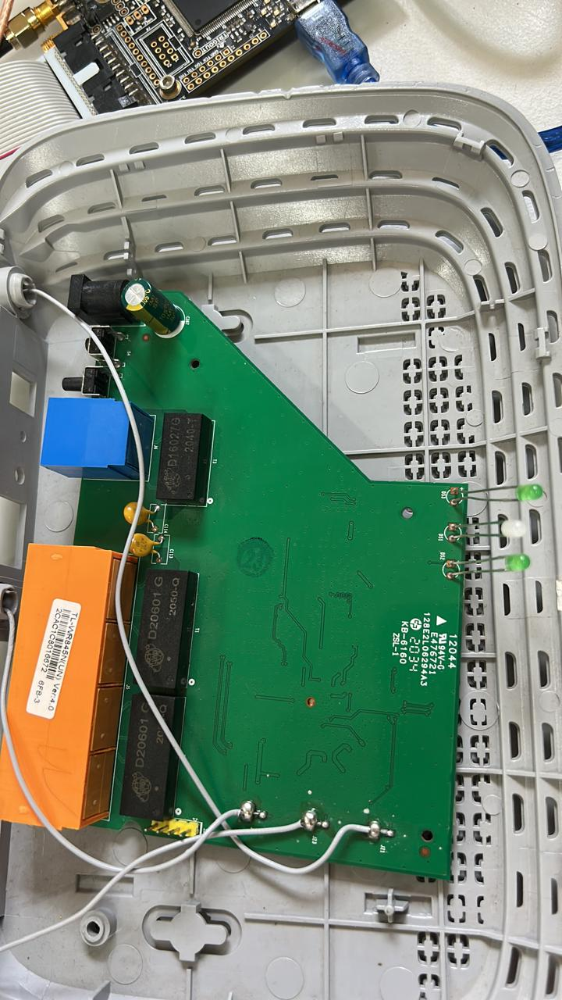

# 🛠️ Router Live Firmware Extraction via UART & Jtagulator

A complete hardware reverse-engineering walk-through detailing how I dumped the live firmware and extracted an unauthenticated root shell from a **TP-Link TL-WR845N (v4.0)** router. This project covers manual multimeter probing, CP2102 USB-to-TTL interfacing, and automated pin verification using the **Jtagulator**.



---

## 🎯 Target Hardware Specifications

* **Device:** TP-Link TL-WR845N (v4.0)
* **Main Processor (SoC):** MediaTek MT7628NN (MIPS24Kc @ 580MHz)
* **RAM:** Zentel 32MB SDRAM
* **Storage:** 4MB SPI Flash Chip (EN25Q32B / Gigadevice)
* **Target Header:** 4-pin unpopulated UART header (`115200` Baud)
* **Primary Interface Tools:** CP2102 USB-to-TTL Adapter, Jtagulator, Digital Multimeter (DMM), PuTTY / Picocom

---

## 📂 Repository Structure & Image Assets

```text
.
├── README.md
├── docs/
│   ├── 01-concepts-and-hardware-recon.md
│   ├── 02-serial-connection-and-root-shell.md
│   └── 03-jtagulator-pin-verification-and-passthrough.md
└── images/
    ├── router_front.jpeg
    ├── router_back.jpeg
    ├── usb_to_ttl.jpeg
    ├── uboot_boot_logs.png
    ├── kernel_boot_logs.png
    ├── mtd_partition_map.png
    ├── root_shell_spawn.png
    ├── jtagulator_help_menu.png
    ├── jtagulator_validation_error.png
    └── jtagulator_active_scan_failed.png
    
    
## ⚡ Executive Summary of the Attack Workflow
Architecture & Board Mapping: Identified the SoC, SDRAM, and SPI Flash chips on the PCB.

Manual Pinout Profiling: Located GND via DMM continuity testing, mapped TX using voltage boot-fluctuation testing, identified RX at static 0V, and isolated VCC at 3.3V.

Serial Interception: Wired a CP2102 adapter (crossed TX/RX, shared GND, isolated VCC) to intercept U-Boot and Linux kernel boot logs at 115200 baud.

Unauthenticated Root Access: Intercepted the boot execution loop where the router launched /bin/sh without password authentication.

Memory Partition Extraction: Identified system MTD blocks (/dev/mtd0 through /dev/mtd4) to extract the live, unencrypted SquashFS filesystem.

Automated Verification: Re-verified pin channels and baud rates using the Jtagulator, mastering continuous passive scanning (T mode) and UART passthrough (P mode).

## 📖 Complete Project Documentation
Read the step-by-step logs in the docs/ folder:

01. Concepts & Hardware Recon – Theory on firmware dumps, flash vs. RAM execution, PCB architecture, and manual DMM pinout discovery.

02. Serial Connection & Root Shell Access – CP2102 wiring, terminal configuration, U-Boot parsing, MTD partition discovery, and obtaining root access.

03. Jtagulator Verification & Passthrough – Automated pin verification, debugging CLI parser bugs, active U vs. passive T scans, and UART passthrough (P) mode.

Maintained by [Sanisa Patrikar]
