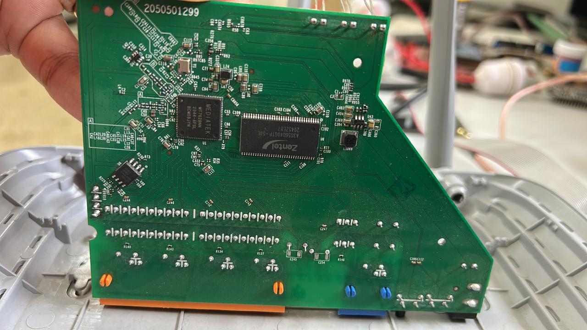

### `docs/01-concepts-and-hardware-recon.md`

# 01. Concepts, Hardware Reconnaissance & Pin Discovery

Before attaching logic tools or terminal consoles, I mapped out the system architecture and identified the physical pins on the circuit board.

---

## 1. Key Concepts & Terminology

### What is a Firmware Dump and Fuzzing?
* **Firmware Dump:** The process of extracting the complete operating system binary (bootloader, Linux kernel, file system, and configuration files) directly out of the physical hardware's non-volatile storage into a `.bin` image for offline analysis.
* **Fuzzing:** An automated software testing technique where invalid or unexpected input data is continuously fed into a target interface (such as a network daemon or web input field) to trigger memory corruption, crashes, or execution bugs.

### Flash Memory vs. SPI Flash Chip
* **Flash Memory:** Non-volatile electronic storage that retains data when power is disconnected.
* **SPI Flash Chip:** The physical 8-pin chip (SOIC-8) holding the flash memory. The CPU communicates with it via the Serial Peripheral Interface (SPI) bus protocol (`CS`, `CLK`, `MOSI`, `MISO`).

### Why Prefer UART over Direct SPI Dumping?
* **SPI Flash Dumping:** Reads static bytes straight off the memory cells. If the manufacturer encrypted the firmware image on the flash chip, dumping SPI directly yields scrambled cipher text.
* **UART Console Interception:** Connects directly to the operating system *after* boot-up. Because the main CPU must decrypt and uncompress the OS into volatile RAM to run it, accessing the system over UART provides live access to an unencrypted, fully functional file system.

---

## 2. Board Architecture & Component Mapping

Opening up the TP-Link TL-WR845N PCB revealed three primary silicon chips working in tandem:



```text
+-------------------------------------------------------+
|  [Ethernet Ports]                                     |
|                                                       |
|    +-------------+      +----------+   (O) (O) (O) (O) |
|    |  MAIN SoC   |      |   RAM    |     UART Header  |
|    | (MT7628NN)  |      | (SDRAM)  |                  |
|    +-------------+      +----------+                  |
|                                                       |
|                        +------------+                 |
|                        | SPI Flash  |                 |
|                        +------------+                 |
+-------------------------------------------------------+
```
* **Main SoC (MediaTek MT7628NN)**: The CPU brain running the MIPS24Kc core @ 580MHz. It has no long-term storage of its own.
* **RAM (Zentel 32MB SDRAM)**: Volatile, high-speed working memory. When power is cut, RAM wipes clean.
* **SPI Flash Chip (EN25Q32B - 4MB)**: Non-volatile storage holding U-Boot, the kernel, and the compressed SquashFS root filesystem.

## 3. Data Flow during the Boot Process
```text
[ Power Turned On ]
        │
        ▼
   [ Main SoC ] ────────(1. Reads Bootloader)───────> [ SPI Flash Chip ]
        │
        │ (2. Initializes RAM & Copies Decompressed OS)
        ▼
   [ RAM Chip ] <─── (3. Clean, Unencrypted Linux OS Executes Here)
        │
        ▼
[ 4. Spawns Shell ] ───> Sent out of the physical UART TX pin
 ```

## 4. Manual Multimeter Pinout Discovery
I spotted an unpopulated 4-pin serial header adjacent to the SoC. To figure out the pin layout safely, I used a Digital Multimeter (DMM):
```text
 [ Pad 1 ]      [ Pad 2 ]      [ Pad 3 ]      [ Pad 4 ]
    0V             3.3V           3.3V           0V
   (GND)          (VCC)           (TX)           (RX)
   ```
* **Finding Ground (GND)**: Set the DMM to Continuity / Beep Mode. Placed one probe on the outer metal shield of an Ethernet port and probed the pads. Pad 1 emitted a continuous beep, so, GND.

* **Finding VCC (Power)**: Set the DMM to DC Voltage Mode and powered on the router. Pad 2 held a static 3.3V, showing zero voltage drop during boot up, so, VCC.

* **Finding TX (Transmit)**: Kept the black probe on GND, placed the red probe on Pad 3, and power-cycled the router. While watching the screen during the first 10 seconds of boot, the reading twitched wildly between 2.8V and 3.3V as the CPU dumped text boot logs, so, TX.

* **Finding RX (Receive)**: Pad 4 sat static at 0V, acting as an open input line waiting for external serial commands, so that's RX.

⚠️ **CRITICAL POWER ISOLATION RULE**:NEVER connect the VCC pin of a USB-to-TTL adapter to a device that is already powered by a wall adapter. Both power sources will fight, creating a back-feed loop that can fry your CP2102 module, the router's main processor, or your laptop's USB controller port. Connect GND, TX, and RX only.5. Voltage Translation (USB-to-TTL)Laptops communicate via USB signaling standards, while router SoCs communicate using Transistor-Transistor Logic (TTL) voltage levels ($0\text{V}$ for binary 0, $3.3\text{V}$ for binary 1). The CP2102 USB-to-TTL Bridge acts as an inline translator between these two voltage domains.
