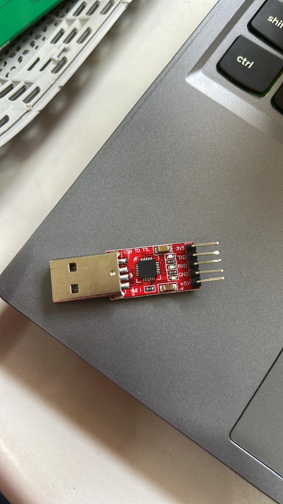
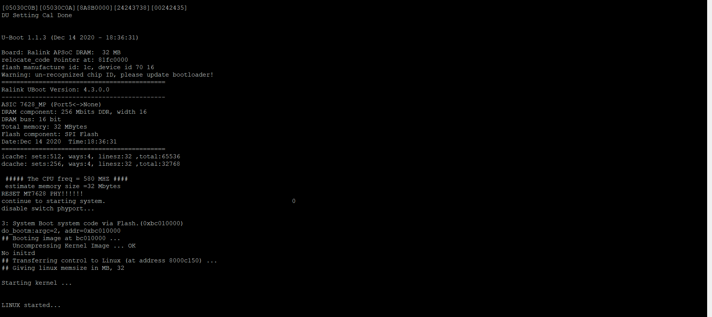
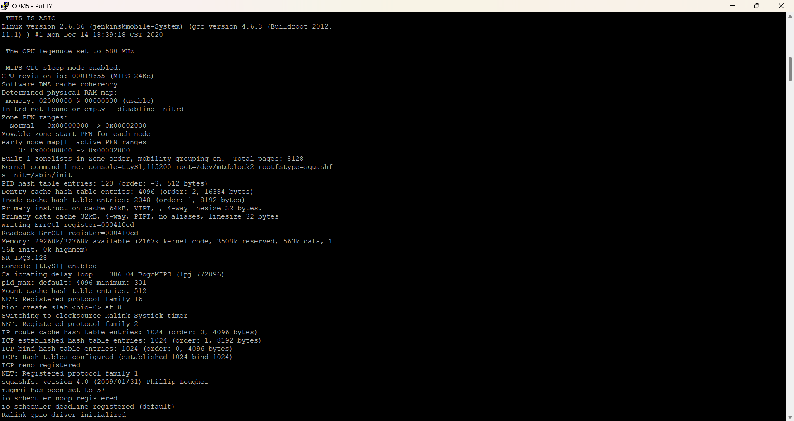
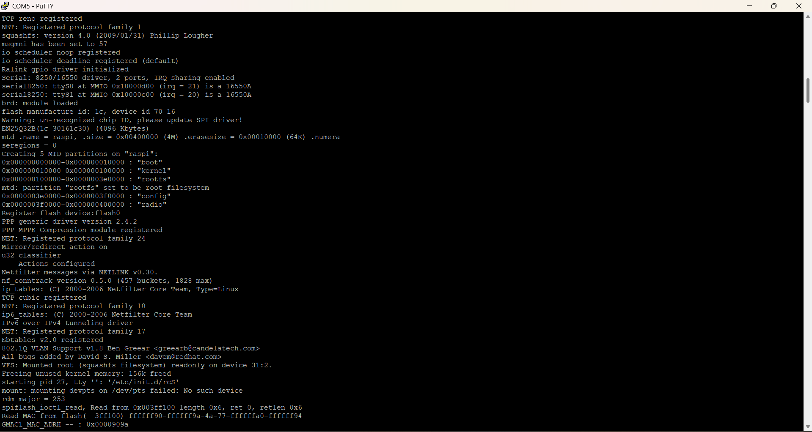

### `docs/02-serial-connection-and-root-shell.md`

# 02. Serial Console Setup, Boot Logs & Root Shell Exploitation

After manually mapping the physical pins, I connected my interface tools to establish a live serial connection and access the underlying operating system.

---

## 1. Physical Hardware Wiring

I connected my **Silicon Labs CP2102 USB-to-TTL Bridge** to the router using crossed data lines:



| CP2102 Adapter Pin | Target Router Pin | Function |
| :--- | :--- | :--- |
| **GND** | **Pad 1 (GND)** | Shared ground reference plane |
| **RXD** | **Pad 3 (TX)** | Adapter receives data sent by the router |
| **TXD** | **Pad 4 (RX)** | Adapter transmits data to the router |
| **3V3 / 5V** | **Pad 2 (VCC)** | **DISCONNECTED (DO NOT POWER)** |

---

## 2. Terminal Console Configuration

### On Windows Host:
1. Opened **Device Manager** $\rightarrow$ **Ports (COM & LPT)**.
2. Verified the device loaded as `Silicon Labs CP210x USB to UART Bridge (COM5)`.
3. Opened **PuTTY**, selected **Serial**, set the port to `COM5`, and set the baud rate to **`115200`**.

### On Linux Host / VM:
Passed the USB bridge into the VM, verified its mount point using `ls /dev/ttyUSB*` (detected as `/dev/ttyUSB0`), and connected using `picocom`:

```bash
sudo picocom -b 115200 /dev/ttyUSB0
```

## 3. Intercepting and Analyzing Boot Logs
Powering on the router immediately streamed the U-Boot bootloader initialization logs into PuTTY. These logs reveal critical architecture details, including the CPU frequency, available RAM (32MB), and the SPI flash layout.




Immediately following the bootloader, the Linux kernel initialized, loaded its hardware drivers, and transferred execution control to the OS.




## 4. Flash Partition Mapping (MTD Table)
As the kernel finished loading, it exposed the system's exact Memory Technology Device (MTD) allocation map. Capturing this map is crucial as it reveals the precise memory offsets and sizes of the boot, kernel, and rootfs (SquashFS) partitions for later extraction.




## 5. Obtaining Unauthenticated Root Shell Access
At the conclusion of the boot process, the kernel executed the startup scripts (/etc/init.d/rcS). Instead of spawning a login prompt asking for user credentials, the serial terminal initialized an unrestricted root shell directly onto the serial interface:

Pressing Enter in the PuTTY window activated the shell, exposing a root prompt (#).

Extracting the Firmware Partitions
With an active root shell, I verified partition structures by querying /proc/mtd:

```bash
cat /proc/mtd
```
To extract the unencrypted SquashFS partition (mtd2 / rootfs), the manual craving command 'dd' can be used:


```bash
dd if=/dev/mtd2 of=/mnt/usb/rootfs.bin
```
