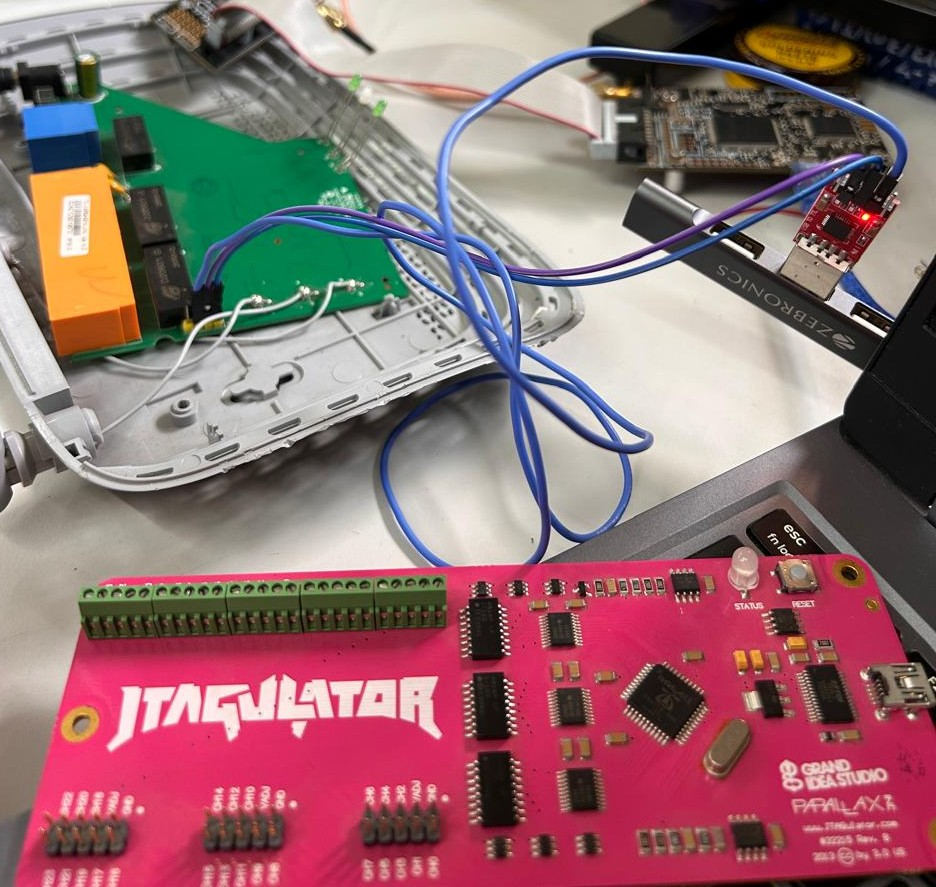
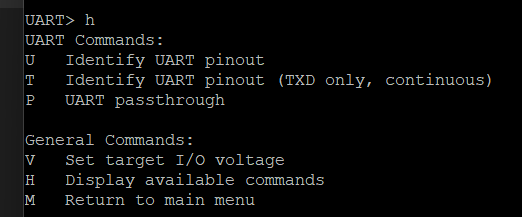
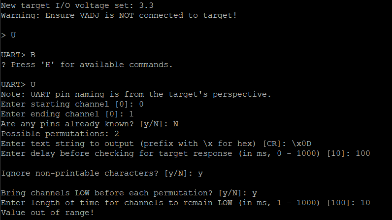
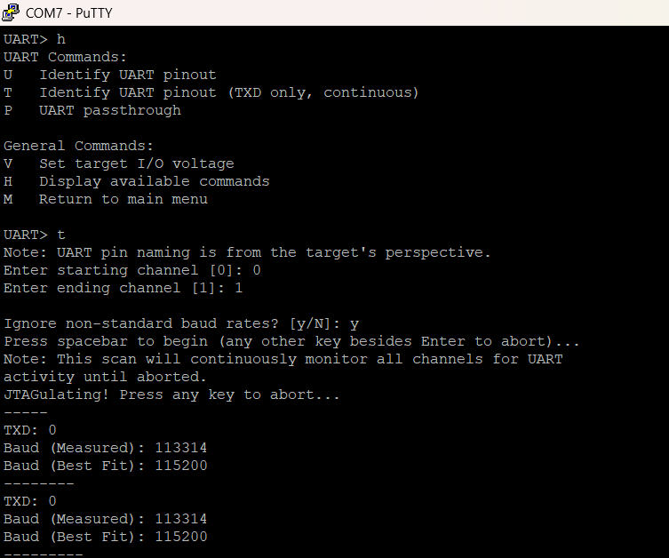
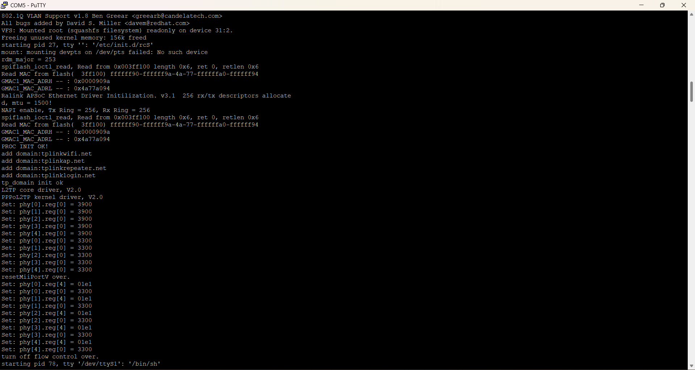

### `docs/03-jtagulator-pin-verification-and-passthrough.md`

# 03. Jtagulator Pin Verification, Parameter Tuning & Passthrough Mode



After extracting the root shell manually using a standard adapter, I brought in the **Jtagulator** to practice automated pin mapping and debug interface brute-forcing. Here is how I mapped the board and bypassed the tool's firmware quirks.

---

## 1. Jtagulator Fundamentals & Limitations

The Jtagulator is an automated logic bridge powered by a Propeller microcontroller. It brute-forces multi-pin headers to find unknown UART and JTAG channels. 



### Core Rules of Jtagulator Scanning:
* **Ground (GND) is Required:** The Jtagulator cannot automatically identify Ground. GND must be identified manually with a multimeter and connected first so both boards share a common electrical reference.
* **Ignores VCC:** The Jtagulator ignores static voltage lines to prevent blowing its onboard logic switches.
* **Identifies Data Lines:** It auto-maps **TX** and **RX** channels across standard or non-standard baud rates.

---

## 2. The "Dual-Serial" Communication Model

It is critical to remember that two separate serial connections operate concurrently when using the Jtagulator:

```text
[ Laptop Terminal ] <===(115200 Baud USB)===> [ Jtagulator ] <===(Dynamic Baud Channels)===> [ Target Board ]
```

* Host Connection: Laptop to Jtagulator USB port (Hardcoded at 115200 baud)
* Target Connection: Jtagulator Channels to Target Pins (Operates dynamically across 9600, 38400, 115200 baud, etc.)

## 3. Debugging CLI Errors & Active Scan Failures
* **Issue 1**: Terminal Parser Validation Bug
Entering a capitalized Y at the prompt Ignore non-printable characters? [Y/n]: crashed the configuration routine (oops).



Resolution: The CLI parser expects plain lowercase y or n inputs.

* **Issue 2**: Active Scan (U Mode) Configuration Failure
Configuring the U (active UART scan) command requires stepping through several parameters; channel range, known pins, output string, response delay, and optional LOW-drive behavior before scanning begins. During this configuration sequence, the JTAGulator rejected one of my inputs with Value out of range!, aborting the scan before it ever reached the "press spacebar to begin" step. 

* Because the scan aborted during configuration, it never sent a single byte to the target, so any baud-rate or payload-formatting mismatch is a moot question; the failure was a CLI input issue, not a communication issue.

* Another possible reason why active scanning could fail was the payload Formatting. While Windows targets expect Carriage Returns (\x0D), embedded Linux environments require a true Newline character (\x0A) to trigger shell command execution.

## 4. Passive Listening (T Mode) - The Reliable Solution
Instead of sending active bytes, the T command (Identify UART pinout - TXD only, continuous) acts as a passive digital scope.

Scan Execution Routine:

* Turned the router OFF.

* Initiated the T command across Channel 0 and Channel 1.

* Powered the router ON.

As the router initialized, the Jtagulator monitored the channel voltage toggles, isolated the active transmission line on Channel 0, and identified the baud rate as 115200. By process of elimination, the remaining silent line on Channel 1 was confirmed as RX.



## 5. UART Passthrough Mode (P)
Once the channel map was established, I enabled UART Passthrough Mode (P) to turn the Jtagulator into a transparent USB-to-TTL bridge:

```text
UART> p
Enter TX channel [0]: 0
Enter RX channel [1]: 1
Enter target baud rate [115200]: 115200
Entering UART passthrough...
Press Ctrl+Z to exit.
Accessing the Target Shell
```
By bridging the connection natively through the Jtagulator, I was piped directly back into the router's active operating system, confirming our automated scan gave us the exact same unrestricted root access as our manual wire setup!




# Key Configuration Settings:

Local Echo: Kept OFF. Linux shells automatically echo typed characters back to the console. Enabling Local Echo in PuTTY results in double-character typing errors (hheellpp).

Exit Shortcut: Pressing Ctrl + X breaks the passthrough tunnel and returns control to the Jtagulator master menu.

# 📑 Parameter References for UART Scans
| Configuration Parameter | Value | Engineering Rationale |
| :--- | :--- | :--- |
| **Output Text String** | `\x0A` | Linux Line Feed (LF) byte to execute empty commands on Unix shells. |
| **Response Delay** | 200 ms | Provides adequate time for the target SoC to process inputs and return data. |
| **Bring Channels Low** | `y` | Connects channels to Ground briefly between iterations to flush old charges. |
| **Time Channels Low** | 10 ms | Clears parasitic wire capacitance without adding unnecessary scan delay. |
| **Ignore Non-Printable** | `y` | Filters out electrical static to ensure only clean ASCII text triggers a match. |
